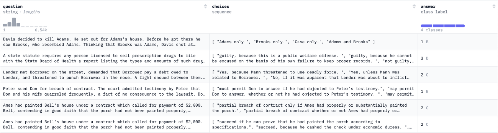

# LLM-Alignment

## Introduction

Simplified alignment techniques aim to enhance the reasoning performance of Large Language Models (LLMs) in long-form question answering. However, this simplification may come at the cost of reasoning depth and accuracy in complex tasks.

The study aims to evaluate how simplified alignment affects the reasoning benchmarks like MMLU and GSM8K, examining the trade-offs between clarity and reasoning performance.

The study hypothesized that simplification could result in changes to reasoning quality, offering both potential benefits and drawbacks.

## Datasets

### Alignment Datasets

- ELI5 Dataset: It contains simplified explanations designed for clarity and accessibility. It also features long-form open-ended questions requiring comprehensive, multi-sentence answers.

### Evaluation Dataset

- MMLU (Massive Multitask Language Understanding): This dataset tests broad knowledge and reasoning across 57 subjects.
  
- GSM8K (Grade School Math 8K): This dataset focuses on multi-step logical reasoning through mathematical word problems.
  

## Methodology

- Researched and standardized datasets.
- For Question and Answer Processing, I used tokenization, text normalization and noise removal. For supporting document processing, I used sentence splitting and selection, heuristic passage extraction, concatenation and restructuring.

- Direct Preference Optimization (DPO) was utilized to fine-tune LLMs.
- The models were trained to prioritize clarity and simplicity in responses, aligning with ELI5-style outputs.

## Evaluation Metrics

1. Quantitative Metric: Accuracy

   - Measure the percentage of correct answers generated by the model compared to the ground truth.
   - It provides a clear metric to compare model performance before and after alignment with examples.

2. Qualitative Metric: ROSCOE
   - A metric designed to evaluate the quality of reasoning in generated responses.
   - It is used to qualitatively analyze how well the model explains its answers, particularly on reasoning-intensive tasks like GSM8K.
   - Key Components:
     - Logical Coherence: It measures it the steps in the reasoning process are logically connected.
     - Relevance: It assesses whether each step contributes meaningfully to the final answer.
     - Completeness: It evaluates whether all necessary reasoning steps are included in the response.

## Results and Observations

### Quantitative Results: MMLU Accuracy by Subject

- Post-alignment improved performance in Humanities (e.g., history, literature), likely due to better contextual understanding with examples.
- Significant drops were observed in STEM and Other Professions, possibly due to oversimplification of responses.
- Overall, the alignment did not yield consistent improvements across categories.

### Qualitative Results: MMLU Reasoning Quality (ROSCOE Scores)

- Logical Coherence improved slightly, indicating better flow between reasoning steps.
- Relevance and Completeness dropped significantly, suggesting a loss of focus and missed intermediate steps in complex reasoning tasks.

### Quantitative Results: GSM8K Accuracy by Type

- Single-Step Questions: Minor improvement (+3.5%) post-alignment suggests examples helped in simpler tasks.
- Multi-Step Questions: Accuracy declined significantly (-5.3%), likely due to oversimplified responses and missing reasoning steps.
- Overall Accuracy: A slight overall drop (-3.2%) indicates alignment trade-offs, especially for complex reasoning.

### Qualitative Results: GSM8K Reasoning Quality (ROSCOE Scores)

- Logical Coherence: Improved slightly, suggesting better flow in reasoning steps.
- Relevance and Completeness: Both dropped, with responses omitting critical intermediate steps or including irrelevant details.

## Real-World Application

- Designing Adaptive LLMs: Develop models that can switch between clarity-focused and reasoning-intensive modes based on task-requirements.
- Applications in Education and Accessibility: Simplified alignment can be used to make complex concepts more accessible in educational tools and customer support systems
- Informing Alignment Strategies: Guide the development of future alignment techniques that balance usability with reasoning performance.

## Conclusion

This study evaluates the impact of simplified alignment on the reasoning capabilities of LLMs. By exploring the trade-offs between clarity and reasoning depth using benchmarks like MMLU and GSM8K, it highlights the challenges and opportunities in designing aligned models.

## Future Work

- Extend alignment evaluation to other styles, such as ethical or factual alignment.
- Explore adaptive alignment strategies that dynamically adjust to task-specific requirements.
- Focus on evaluating reasoning chain better.
- Investigate scalability and computational efficiency in alignment techniques.
